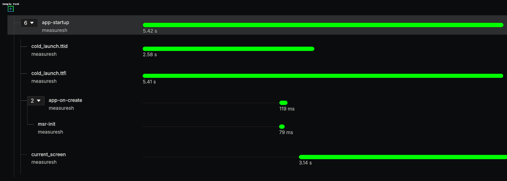

# Feature - Performance Tracing

Tracing helps understand how long certain operations take to complete, from the moment they begin until they finish,
including all the intermediate steps, dependencies, and parallel activities that occur during execution.

A **trace** represents the entire operation, which could be a complete user journey like onboarding, further divided
into multiple steps like login, create profile, etc. A trace is represented by a `trace_id`.

A **span** is the fundamental building block of a trace. A span represents a single unit of work. This could be a HTTP
request, a database query, a function call, etc. Each span contains information about the operation — when it started,
how long it took and whether it completed successfully or not. A span is identified using a `span_id` and a user
defined `name`.

To achieve this, spans in a trace are organized as a Directed Acyclic Graph (DAG). Which means spans can have a parent
span and each span can have multiple children. This is done by adding a **parent_id** to each span, whose value is
the `span_id` of its parent.

Example *app_startup* trace:



## API Reference

### Start a span

A span can be started using `startSpan` function.

```kotlin
val span: Span = Measure.startSpan("span-name")
```

A span can also be started by providing the start time, this is useful in cases where a certain operation has already
started but there wasn't any way to access the Measure APIs in that part of the code.

```kotlin
val span: Span = Measure.startSpan("span-name", timestamp = System.currentTimeMillis())
```

### End a span

A span can be ended using `end` function. Status is mandatory to set when ending a span.

```kotlin
val span: Span = Measure.startSpan("span-name")
span.end(Status.Ok)
```

A span can also be ended by providing the end time, this is useful in cases where a certain operation has already ended
but there wasn't any way to access the Measure APIs in that part of the code.

```kotlin
val span: Span = Measure.startSpan("span-name")
span.end(Status.Ok, timestamp = System.currentTimeMillis())
```

### Set parent span

```kotlin
val parentSpan: Span = Measure.startSpan("parent-span")
val childSpan: Span = Measure.startSpan("child-span").setParent(parentSpan)
```

### Add checkpoint to a span

```kotlin
val span: Span = Measure.startSpan("span-name").setCheckpoint("checkpoint-name")
```

### Using scopes

A span can be put in *scope*. Putting in scope means putting the span in thread local. When a span is in
scope it is automatically added as a parent span for all spans created within it's scope. In the following example the
child span will automatically have *spanA* set as it's parent, without having to call
`setParent` explicitly.

```kotlin
val spanA: Span = Measure.startSpan("spanA")
Measure.withScope(spanA) {
    val childSpan = Measure.startSpan("child-span")
    childSpan.end()
}
spanA.end()
```

### Set no parent

To explicitly opt out of setting a parent to a span, start the span with `setNoParent` flag.

```kotlin
val span: Span = Measure.startSpan("span-name", setNoParent = true)
```

### Using span builder

The span builder API allows pre-configuring a span without starting it immediately.

```kotlin
val spanBuilder: SpanBuilder = Measure.createSpan("span-name")
val span: Span = spanBuilder.startSpan()
```

The span builder also allows setting parent or no parent directly using the builder:

```kotlin
val spanBuilder: SpanBuilder = Measure.createSpan("span-name")
    .setNoParent()
val span: Span = spanBuilder.startSpan()
```

```kotlin
val spanBuilder: SpanBuilder = Measure.createSpan("span-name")
    .setParent(parentSpan)
val span: Span = spanBuilder.startSpan()
```
